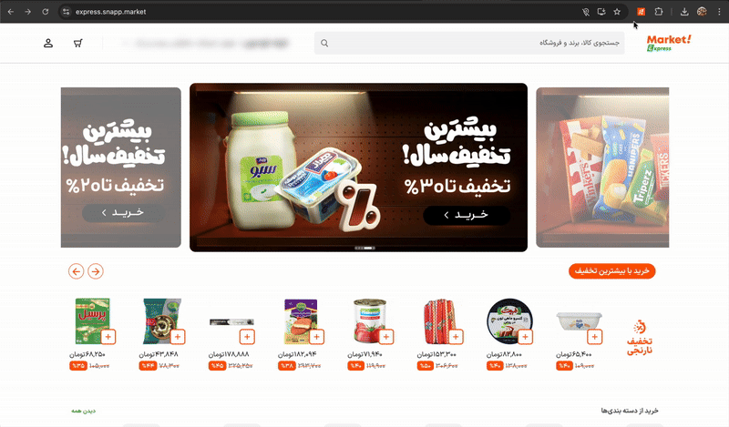

# Snapp Express Basket Helper

A Chrome extension (Manifest V3) that helps users find Snapp Express supermarkets that carry **all** products in their shopping list. The extension searches through available stores and displays only those vendors that have every item you need.

## Features

- 🛒 **Shopping List Management**: Add multiple products to your shopping list with an intuitive interface
- 🔍 **Smart Store Search**: Searches Snapp Express API for stores that carry all your products
- 📍 **Store Information**: Displays store details including:
  - Store name and address
  - Store icon/logo
  - Rating
  - Delivery fee
  - Delivery time
- 🖼️ **Product Images**: Shows images of matched products for each store
- 🔗 **Direct Links**: Click on store names to navigate directly to the store page
- 🌐 **Persian Language Support**: Fully localized interface in Persian (Farsi) with RTL layout
- ⚡ **Fast & Efficient**: Parallel API calls for quick results

## Installation

### From Source

1. Clone or download this repository
2. Open Chrome and navigate to `chrome://extensions/`
3. Enable "Developer mode" (toggle in the top right)
4. Click "Load unpacked"
5. Select the extension directory (`snappmarket-extension`)
6. The extension icon should now appear in your Chrome toolbar

## Usage

1. **Navigate to Snapp Express**: Open [https://express.snapp.market](https://express.snapp.market) in your browser
2. **Open Extension**: Click the extension icon in your Chrome toolbar
3. **Add Products**: 
   - Enter product names in the input fields (at least 2 fields are provided by default)
   - Click "+ افزودن محصول" to add more product fields
   - Click "×" to remove a product field (minimum 1 field required)
4. **Search**: 
   - Click "جستجوی فروشگاه‌ها" button, or
   - Press Enter in any product input field
5. **View Results**: 
   - Results are displayed in an overlay panel on the right side of the page
   - Each store card shows:
     - Store icon and name (clickable link)
     - Address
     - Rating, delivery fee, and delivery time
     - Images of matched products
   - Results are sorted by delivery fee (lowest first)
6. **Navigate to Store**: Click on any store name to open its page in the same tab

## Requirements

- Google Chrome browser (latest version recommended)
- Active account on Snapp Express (must be logged in to express.snapp.market)
- Internet connection

## Browser Compatibility

- ✅ Chrome (Manifest V3)
- ✅ Edge (Chromium-based)
- ✅ Other Chromium-based browsers

## TODO

- [ ] Show store badges (PRO, Free delivery)
- [ ] Link to view product
- [ ] Add all items to cart at once
